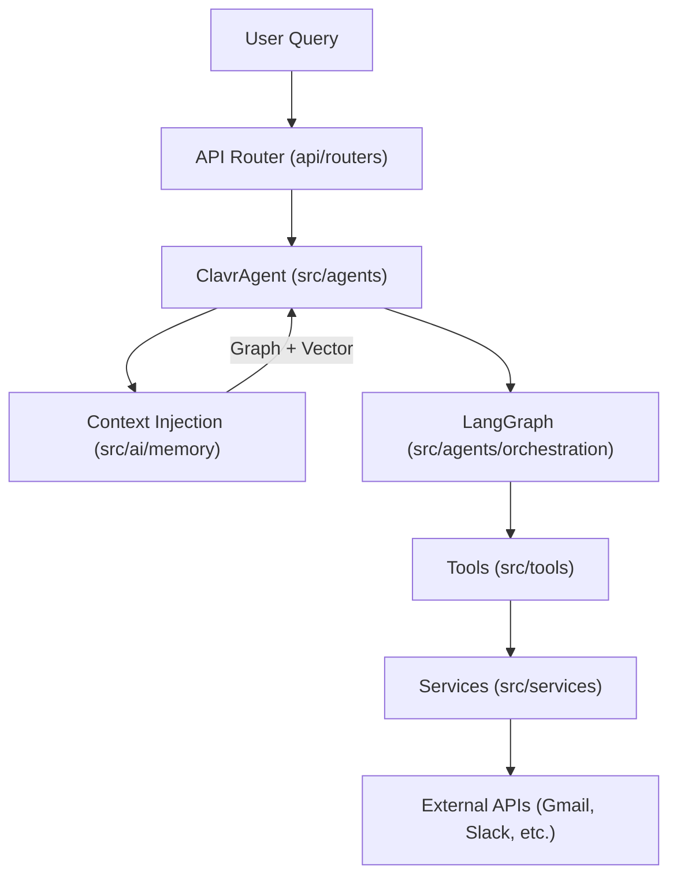

# Clavr Engineering Onboarding Guide

Welcome to the Clavr team! This guide will help you understand our system, set up your development environment, and start contributing to the future of autonomous digital work.

---

## 1. Prerequisites
- **Python**: 3.13.7 (Verified current env version).
- **Service Tokens**: You will need API keys for Google Gemini, Qdrant, and ArangoDB (shared via internal secure vault).
- **Local Infrastructure**:
    - **PostgreSQL**: For relational data and relational RAG fallback.
    - **Redis**: For Celery task queue and caching.
    - **Optional**: Docker for running these services locally.

---

## 2. Fast Setup (The "80/20" Rule)

1. **Clone & Virtual Env**:
   ```bash
   git clone <repo-url>
   cd clavr
   python -m venv venv
   source venv/bin/activate
   pip install -r requirements.txt
   ```

2. **Environment Configuration**:
   Copy `.env.example` to `.env` and fill in the required keys.
   > [!IMPORTANT]
   > Ensure `ENCRYPTION_KEY` is set; it's used for securing user OAuth tokens in the database.

3. **Initialize Database**:
   ```bash
   alembic upgrade head
   ```

4. **Run the System**:
   We use a convenience script to start everything (API + Workers):
   ```bash
   python main.py
   ```
   *The API will be available at `http://localhost:8000`.*

---

## 3. High-Level Architecture

Clavr is an **agentic system** that turns natural language into actions across various APIs.

### The Request Flow


### Core Layers
1. **API Layer (`api/`)**: FastAPI endpoints. Modular, router-based architecture.
2. **Agent Layer (`src/agents/`)**: The decision-making "Brain".
    - `supervisor.py`: Higher-order planning.
    - `base.py`: The abstract interface for all agent capabilities.
3. **Memory Layer (`src/ai/memory/`)**:
    - **Vector Search**: Qdrant/PostgreSQL for semantic history.
    - **Knowledge Graph**: ArangoDB for entity relationship tracking.
4. **Tool/Integration Layer (`src/tools/`, `src/integrations/`)**: The "Muscle". Actions like `send_email` or `create_task`.

---

## 4. Developer Workflow

### Testing & Quality
We maintain a strict quality bar. Before submitting a PR:
- **Linting**: `make lint` (uses Flake8/Pylint).
- **Formatting**: `make format` (uses Black/Isort).
- **Tests**: `pytest` (ensure you have the test database configured).
- **Circular Imports**: `make check-imports`.

### Circular Import Management
Clavr has a strict import hierarchy to avoid the common Python "Circular Import" trap:
1. `utils/` (Bottom - No dependencies)
2. `ai/` (Depends on utils)
3. `core/` (Depends on ai, utils)
4. `services/` (Depends on core, ai, utils)
5. `agents/` (Top - Orchestrates everything)

---

## 5. Adding Your First Feature

If you are asked to "Add a new integration" (e.g., Jira):

1. **Service**: Create `src/integrations/jira/service.py` to handle raw API calls.
2. **Service Layer**: Add Jira logic to `src/services/jira_service.py` (business logic, data mapping).
3. **Tool**: Create `src/tools/jira/tool.py` following the `BaseTool` pattern.
4. **Dependency Injection**: Register the new tool in `api/dependencies.py` so the API can instantiate it.
5. **Agent Enrichment**: Update the Agent's tool list in `src/agents/supervisor.py` or through the orchestrator.

---

## 6. Resources & Debugging
- **Swagger Documentation**: `http://localhost:8000/docs` (Your best friend for testing endpoints).
- **Logs**: Located in `logs/` directory.
- **Debug Scripts**: Check the root directory for `debug_*.py` files; they are useful for isolated tests of Neo4j, Qdrant, or specific services.

---

Welcome aboard! Let's build something autonomous.
